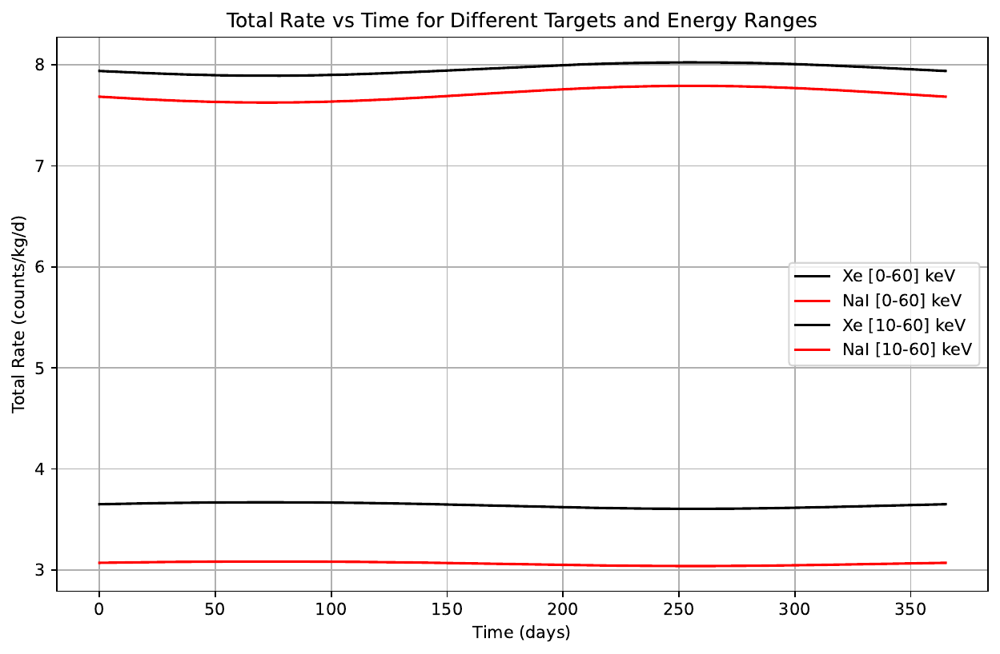
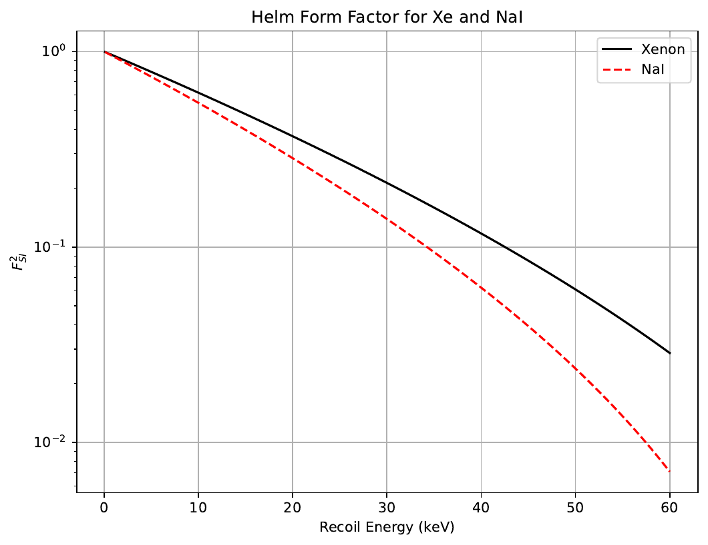
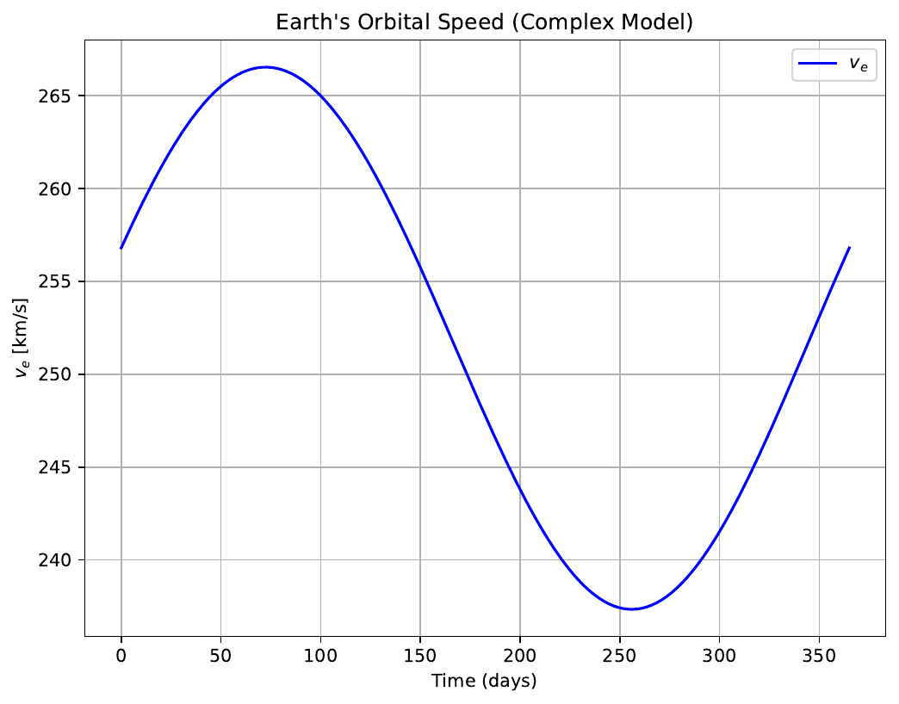

# Dark Matter Direct Detection Simulation

Simulation of the expected event rate in direct detection experiments for a 70 GeV WIMP, comparing Xenon and NaI targets within the Standard Halo Model (SHM).

  
  

<b>Left:</b> total event rate above threshold for a 70 GeV WIMP, Xenon
versus NaI. <b>Right:</b> the Helm nuclear form factor, which suppresses the
rate at high momentum transfer and is the reason the two targets behave
differently.

  

Earth's speed through the galactic halo over the year — the origin of the
annual modulation of the expected signal.

---

## Overview

This project provides a numerical simulation of WIMP-nucleus elastic scattering, including:

- Helm nuclear form factor
- Standard Halo Model (SHM)
- Mean inverse speed
- Differential and total event rate
- Annual modulation of the signal
- Sinusoidal approximation of the modulation

---

## Physical Model

### Momentum transfer

$$
q = \sqrt{2 m_N E_R}
$$

where:
- $m_N$ is the nuclear mass  
- $E_R$ is the recoil energy  

---

### Helm Form Factor

$$
F^2(q) =
\left[
3 \frac{j_1(qR_1)}{qR_1}
\right]^2
e^{-q^2 s^2}
$$

with:

$$
j_1(x) = \frac{\sin x}{x^2} - \frac{\cos x}{x}
\quad\quad\quad   \text{and}   \quad\quad\quad
R_1 = \sqrt{R_N^2 - 5s^2}
$$

---

### Minimum WIMP Velocity

$$
v_{min} =
\sqrt{
\frac{E_R m_N}{2 \mu_N^2}
}
\quad\quad\quad   \text{with}   \quad\quad\quad
\mu_N =
\frac{m_\chi m_N}{m_\chi + m_N}
$$

---

### Mean Inverse Speed

$$
\eta(E_R,t) =
\int_{v > v_{min}}
\frac{f(\vec{v},t)}{v}
\~ d^3v
$$

Computed analytically assuming a Maxwellian velocity distribution (Standard Halo Model).

---

### Differential Event Rate

$$
\frac{dR}{dE_R} \propto
\frac{\rho_\chi}{m_\chi}
\sigma_{SI}
\~A^2
\~F^2(E_R)
\~\eta(E_R,t)
$$

where:
- $\rho_\chi$ is the local dark matter density  
- $\sigma_{SI}$ is the spin-independent cross section  
- $A^2$ is the coherent enhancement factor  

---

### Total Rate

$$
R(t) =
\int_{E_{min}}^{E_{max}}
\frac{dR}{dE_R} \~ dE_R
$$

Numerically evaluated using the trapezoidal rule.

---

### Annual Modulation

$$
R(t) =
R_0 + R_{mod}
\~\cos\left(
\frac{2\pi}{365}(t - t_{max})
\right)
\quad\quad\quad   \text{with}   \quad\quad\quad
R_{mod} = \frac{R_{max} - R_{min}}{2}
$$

---

## Parameters

| Quantity | Value |
|----------|------|
| WIMP mass | $70 \~ \text{GeV}$ |
| Local DM density | $0.3 \~ \text{GeV/cm}^3$ |
| Cross section | $10^{-41} \~ \text{cm}^2$ |
| Xenon | $A = 132$ |
| NaI | $A \approx 150$ |

---

## Output

The script generates and saves plots in the `Images/` folder:

- Helm form factor
- Earth's velocity vs time
- Mean inverse speed
- Total rate vs time
- Annual modulation comparison
